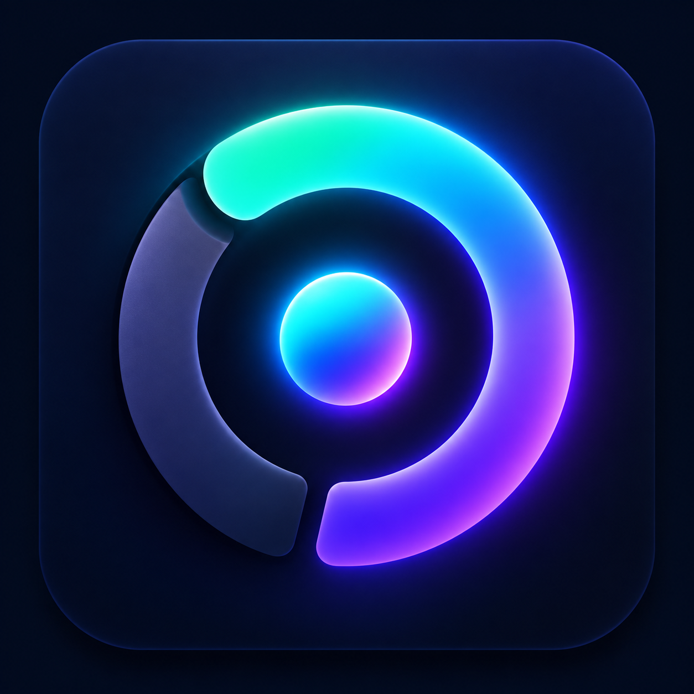
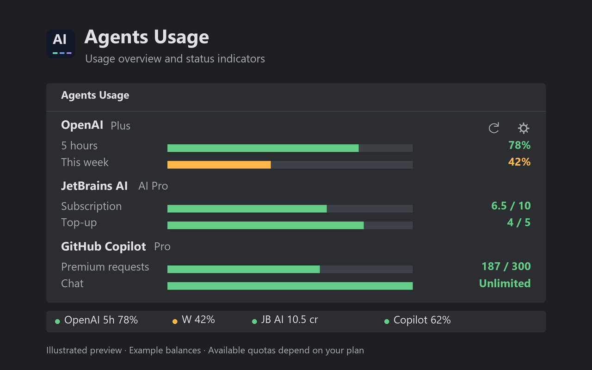

# AgentMeter

A [standalone Windows app](windows/README.md) is also available: a portable `.exe` showing quotas without a running IDE,
with official agent sign-in buttons and configurable automatic refresh. JetBrains AI quota currently requires the IDE
integration.

The Windows app also includes OpenRouter, Kilo, Cline, OpenCode and Junie CLI, separate provider configuration pages,
six bar layouts, five palettes, a refresh progress display and saved usage across restarts. App/window/tray icons
share the supplied SVG. Existing selections and the shared version **1.1.0** remain unchanged.

| Edition                 | Supported providers                                                                                              | Guide                                   |
|-------------------------|------------------------------------------------------------------------------------------------------------------|-----------------------------------------|
| Rider / JetBrains       | Codex, JetBrains AI, Copilot, Claude, Cursor                                                                     | This README                             |
| Windows desktop         | Codex, Copilot, Claude, Cursor, Gemini, OpenRouter, Kilo, Cline, OpenCode, Junie CLI                             | [Windows](windows/README.md)            |
| Chrome / Edge browser   | Background quota: Codex, Claude, Cursor, Copilot, Gemini Apps; optional persistent bar (live validation pending) | [Browser](browser/README.md)            |
| Visual Studio Code      | Codex, Copilot                                                                                                   | [VS Code](vscode/README.md)             |
| Visual Studio 2022/2026 | Codex, Copilot                                                                                                   | [Visual Studio](visualstudio/README.md) |

See the [documentation index](docs/README.md) and [provider/data comparison](docs/PROVIDERS.md).

<p></p>

AgentMeter, maintained by Lars Nörber, is available for JetBrains IDEs, including IntelliJ IDEA and Rider, and as an
extension for Visual Studio Code. It displays Codex 5-hour and weekly usage, JetBrains AI credits, and GitHub Copilot
quotas in JetBrains IDEs. The VS Code extension displays Codex and GitHub Copilot quota. A native Visual Studio
2022/2026 extension provides Codex and Copilot quota in Community, Professional and Enterprise on Windows x64.
The status bar displays `OpenAi | D=78% - W=42%`, `JetBrainAi | 70%`, and `Copilot | 38%` (example balances).
OpenAI and JetBrains AI show remaining quota. Copilot shows consumed quota: 0% unused, 100% exhausted.
Each percentage uses its quota color directly; OpenAI D and W have independent colors, without dots.
Click any provider widget to open **AgentMeter**.
The Rider/JetBrains overview also supports Cursor account quota through its ACP sign-in,
and Claude subscription quota and monthly local tokens. On a fresh Rider installation only JetBrains AI is enabled;
select additional providers in **Visible agents**. Claude and OpenAI show remaining subscription quota; without
subscription quotas Claude shows recorded local tokens or its API connection state. Cursor shows consumed quota.
Visible widgets stay together in OpenAI, JetBrains AI, Copilot order when agents are toggled.

For the source layout, read [Code structure](docs/ARCHITECTURE.md). Contributors and agents should start with
[Project rules](AGENTS.md) and [Local development](docs/DEVELOPMENT.md).

> Codex is a trademark of OpenAI. This independent plugin is not affiliated with or endorsed by OpenAI.

## Features

- Separate status indicators for remaining 5-hour and weekly usage.
- Additional JetBrains AI status indicator with the remaining credit percentage when AI Assistant is installed and
  enabled.
- JetBrains AI subscription and top-up credit details in the Tool Window.
- Independent GitHub Copilot status indicator and quota details through its IDE plugin or installed ACP agent.
- Subscription plan displayed in every provider view, with Unknown when the provider has not reported its plan.
- Compact colored bars showing remaining OpenAI/JetBrains AI balances and consumed Copilot quota.
- Compact agent cards with identity accents, subscription badges, and four visible quota/reset/report facts.
- Click an agent's subscription badge to show category balances, full reset dates, refresh interval and availability
  status. Click again to hide the details.
- Agent checkboxes control visibility in both the overview and status bar; deselected quota reads pause.
- Tool Window with quota, reset time, countdown, and progress details.
- Collapsible weekly quest recap with a provider party, quota forecast, and boss battle; it adapts to the Tool Window
  width and remembers its open or closed state.
- Manual refresh and configurable automatic refresh intervals.
- Automatic discovery of `codex` from the system `PATH`.
- English interface, tooltips, settings, and error messages.
- Click the subscription badge for a usage chart with distinct colored series,
  consumed percentages, reset countdowns and rings, and selectable 1/6/24-hour views.
  The local 24-hour history starts with observations made while provider panels exist; it cannot reconstruct past
  account usage. Observation gaps and quota resets are kept separate.
- Use the **Weekly** and **Games** checkboxes in configuration to activate or deactivate those areas. Both are off
  by default on a fresh installation. Choices survive
  restarts; collapsing a section remains a separate choice.
- Weekly bosses lose 4 HP per observed percentage point of quota consumption. All selected quota providers contribute;
  a 1-point change produces a visible hit. Claude and Cursor participate when quota percentages are available.
- Boss hits flash and briefly shake the boss, with colored feedback such as **Hit by Claude · 4 Points**. Only actual
  quota changes generate hits; repeated refreshes and restored history do not replay attacks.

### Cursor and Claude data sources (JetBrains)

Cursor prefers its official Agent login store: `%APPDATA%/Cursor/auth.json` on Windows, `~/.cursor/auth.json` on macOS,
and `$XDG_CONFIG_HOME/cursor/auth.json` or `~/.config/cursor/auth.json` on Linux. It requests Cursor's usage summary and
can
fall back to Cursor's authenticated current-period endpoint when the web dashboard returns HTTP 403. Shared team
pools are labeled explicitly. Missing finite limits stay unavailable. Automatic account refreshes run at least 60
seconds apart.

Claude reads Claude Code's `.credentials.json` under `~/.claude` (or absolute `CLAUDE_CONFIG_DIR`) and requests the
subscription usage endpoint. Session, weekly, Sonnet and Opus windows appear when reported. The local token scanner
continues to show this month's Claude Code logs. Automatic quota refreshes run at least 180 seconds apart. Expired
credentials require renewal in Claude Code. With an ACP API-key login, the official CLI reports the connection state;
Pro/Max quota percentages do not apply. The selected, installed Claude agent remains visible. Missing local token
records are shown as unavailable rather than zero usage. Keychain-only subscription credentials cannot currently be
read.

These account endpoints and local formats can change. Credentials stay in memory for provider requests, are never
printed or copied into plugin settings/history, and are not sent to other services. Redirects are disabled. No
provider login or token refresh is performed by this plugin.

## Usage preview



Illustrated preview with example balances. Available quotas depend on your subscription and installed provider plugins.
See [Marketplace media](docs/MARKETPLACE.md) for the image files and listing instructions.

## Install

### JetBrains IDEs

1. Download the plugin ZIP from [GitHub Releases](https://github.com/larsnoerber/Rider_Agents_Usage/releases/latest).
2. In your IDE, open **Settings > Plugins**, click the gear icon, and choose **Install Plugin from Disk**.
3. Select the ZIP and restart the IDE if prompted.
4. Open **View > Tool Windows > AgentMeter**, or click the `OpenAi` status bar widget.

AgentMeter uses the stable plugin ID `io.github.larsnoerber.agentsusage`.

The current CLI integration requires Windows and an IntelliJ Platform IDE version 2026.1 or later. Codex CLI must
already be installed and signed in locally.

### Visual Studio Code

Download `agents-usage-vscode-<version>.vsix` from GitHub Releases, then run **Extensions: Install from VSIX...** in
VS Code. The extension requires Codex CLI to be installed and signed in. Open the **AgentMeter** Activity Bar view,
or click its status bar item to see the reported 5-hour and weekly quotas.
AgentMeter displays quota only; install
the [OpenAI Codex extension](https://marketplace.visualstudio.com/items?itemName=openai.chatgpt)
separately to use Codex as a coding agent in VS Code.

### Visual Studio Community, Professional and Enterprise

Build or download `agents-usage-visualstudio-<version>.vsix`, close Visual Studio and open the package with
Visual Studio's VSIX Installer. Then choose **View > Other Windows > AgentMeter**.
Use **Settings** in the window to configure Codex/Copilot visibility, status display, CLI path and refresh interval.
Codex reports remaining quota; GitHub Copilot reports consumption through Visual Studio's existing quota service.
Click the AI icon in the Standard toolbar or status bar to open Usage. Older Copilot builds may not expose quotas.
The build includes [Visual Studio Marketplace upload materials](visualstudio/Marketplace/README.md).
See [Visual Studio setup](visualstudio/README.md).

## Settings

Usage refreshes every 60 seconds by default. Open **Settings > Tools > AgentMeter** to set the CLI path or a refresh
interval between 10 and 3600 seconds. Leave the path empty to discover Codex CLI automatically from `PATH`.

The Tool Window also provides refresh presets of 30 seconds, 1 minute, and 5 minutes, plus a custom interval.
The toolbar stays visible above the agent cards. The Tool Window configuration and IDE Settings both offer **Visible
agents** checkboxes for OpenAI, JetBrains AI, GitHub Copilot, Claude and Cursor. Uncheck an agent to remove its
overview card and
status widget and pause its background quota reads. Providers require their installed ACP package or loaded IDE plugin.
Applying settings updates visibility and refreshes selected providers. Zero quota remains visible.
Fresh Rider installations enable only JetBrains AI; Weekly and Games are disabled. Saved choices are preserved on
updates.
Configuration identifies missing ACP packages beneath their checkboxes. Install them through Rider's ACP Registry;
the usage configuration has no installation buttons.

The same refresh interval applies to all providers. The plugin reads the running AI Assistant quota service and
requests updates through AI Assistant. Sign in to JetBrains AI Assistant to see your balance. Click either status
indicator to open the Tool Window; **Refresh** updates all available providers. The JetBrains AI widget can be toggled
independently in the status bar context menu.

JetBrains AI integration uses an internal AI Assistant API, including its own quota-to-credit conversion. Future AI
Assistant versions may require an integration update. If the API or balance is unavailable, the widget displays `—` with
an explanation instead of a credit amount.

## Build

Use a JDK 25 installation, such as the JetBrains Runtime bundled with a compatible IDE, and set `JAVA_HOME` to its
directory. The plugin targets IntelliJ IDEA 2026.1.2 and compiles to Java 21 bytecode. Its compatibility range starts
at build 261 and has no upper bound; the build verifies against Rider 2026.2.3.1.

```powershell
.\gradlew.bat buildPlugin
```

The installable ZIP is written to `build/distributions/agentmeter-<version>.zip`.
Project identity and the release version are configured in `gradle.properties`.
Both Gradle wrapper scripts are required for builds; see [Build files](docs/DEVELOPMENT.md#gradle-build-files).

To build the VS Code extension, install Node.js 22 or later and run `npm install` from `vscode/`. Then run
`npm run package` in that directory to create `agents-usage-vscode-<version>.vsix`. After installing these npm
dependencies, `.\gradlew.bat buildAllExtensions` builds the JetBrains and VS Code packages. On Windows it also builds
the Visual Studio package when Visual Studio MSBuild is installed.
See [VS Code development](docs/DEVELOPMENT.md#visual-studio-code-extension).

To launch a development IDE:

```powershell
.\gradlew.bat runIde
```

## CLI integration

The plugin invokes the local Codex CLI app-server and requests `account/rateLimits/read`. It does not depend on an
interactive terminal or browser cookies. Changes to this local protocol in future CLI versions may require a plugin
update.

## Privacy

The plugin invokes the locally installed Codex CLI and reads quota information from the installed JetBrains AI
Assistant and GitHub Copilot plugins. Balance refreshes use those plugins' existing provider connections. The plugin
displays this information inside the IDE and does not upload it to any additional server.

## Maintainer and license

AgentMeter is maintained by **Lars Nörber**. Source code and support are available
at [larsnoerber/Rider_Agents_Usage](https://github.com/larsnoerber/Rider_Agents_Usage).

The source code is licensed under the [MIT License](LICENSE). Use of the distributed plugin is governed by
the [End-User License Agreement](EULA.md).

See [CHANGELOG.md](CHANGELOG.md) for release changes.
