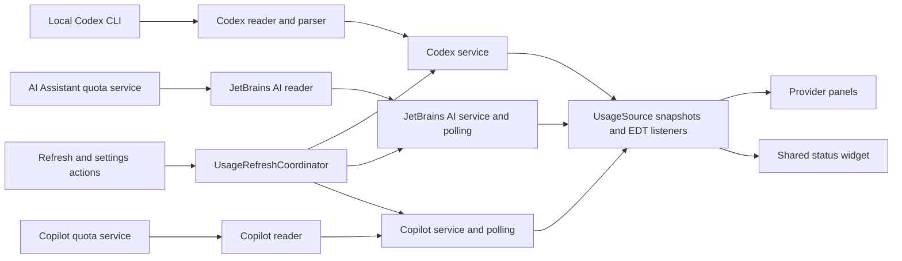

# Code structure

Source packages are rooted at `io.github.larsnoerber.agentsusage`.
Provider code is grouped by feature, so a provider change can be understood in one place.

```text
Agents Usage/
├── AGENTS.md                         Project rules
├── README.md                         Installation and usage
├── CHANGELOG.md                      Release history
├── docs/
│   ├── ARCHITECTURE.md               Packages, responsibilities, and data flow
│   ├── DEVELOPMENT.md                Build, development IDE, and integration notes
│   ├── MARKETPLACE.md                Listing preview and media upload instructions
│   └── images/                       Illustrated listing assets (PNG and editable SVG)
├── tools/                           Documentation asset renderer
├── build.gradle.kts                 JetBrains build and aggregate multi-extension build
├── settings.gradle.kts              Repository configuration and project name lookup
├── gradle.properties                Central project identity, version, and daemon settings
├── gradlew / gradlew.bat             Gradle launchers for POSIX / Windows
├── gradle/wrapper/                   Wrapper bootstrap and pinned distribution settings
├── .gitattributes                   Wrapper and properties line endings
├── src/main/
    ├── kotlin/io/github/larsnoerber/agentsusage/
    │   ├── application/             Coordinates actions across all providers
    │   ├── core/
    │   │   ├── UsageSource.kt        UI-facing snapshot/listener contract
    │   │   ├── format/              Subscription labels, dates, and countdowns
    │   │   ├── reflection/          Optional plugin discovery and API getters
    │   │   └── refresh/             Shared background polling
    │   ├── providers/
    │   │   ├── codex/               CLI transport, JSON parsing, model, and service
    │   │   │   └── ui/              OpenAI panel, countdown card, and status factory
    │   │   ├── jetbrainsai/          AI Assistant reader, credit model, and service
    │   │   │   └── ui/              Credit panel and status factory
    │   │   └── copilot/             Copilot reader, quota model, and service
    │   │       └── ui/              Quota panel and status factory
    │   ├── settings/                Persisted choices and IDE Settings page
    │   └── ui/
    │       ├── components/          Bars, headers, tooltips, toolbar, and status widget
    │       ├── settings/            Refresh presets and custom interval controls
    │       └── toolwindow/          IntelliJ factory, composition, and page navigation
    └── resources/
        ├── META-INF/               Plugin registrations and plugin logo
        └── icons/                  Small Tool Window icon
├── vscode/                         VS Code extension (TypeScript, its own API and package)
    ├── package.json                VS Code manifest and npm build scripts
    └── src/                        Extension activation, Codex and Copilot readers, and quota webview
└── visualstudio/                   Visual Studio 2022/2026 extension (C#, stable VSSDK, WPF)
    ├── AgentsUsagePackage.cs        Package registration and opening the usage window
    ├── Providers/Codex/            CLI reader and provider-reported quota snapshot
    ├── Core/Processes/             Process-tree lifetime through Windows job objects
    ├── Settings/                   Visual Studio Options page and saved user choices
    ├── UI/                         Native tool window, quota bars and refresh lifecycle
    └── build.ps1                   Shared-version MSBuild packaging into dist/
```

`build/`, `.gradle/`, `.intellijPlatform/`, `.kotlin/`, and `.idea/` are generated local directories.
They are not part of the source architecture and remain ignored by Git.

The VS Code extension shares the repository, release version, provider definitions, and product documentation with
the JetBrains plugin. Its editor integration and provider readers live under `vscode/` because the VS Code Extension
API and Node.js process model differ from the IntelliJ Platform APIs. Codex reads reported quota through the local
Codex CLI app-server. Copilot reads GitHub's internal quota endpoint using VS Code's GitHub authentication. Neither
provider estimates usage from local activity; the Copilot endpoint is not a supported public API and can change.
The sidebar renders provider-reported values in a themed WebviewView so quota percentages and bars can use quota
colors; provider selection and refresh settings remain in VS Code's native Settings UI.
Quota bars use native progress elements and CSS classes within the webview's nonce-authorized stylesheet. The Activity
Bar uses a transparent, monochrome version of the Rider AI monogram; Marketplace artwork retains the colored logo.
Copilot selects chat for Free plans, skips empty 0/0 snapshots, and keeps unlimited categories separate from finite
consumption percentages. A missing premium balance is not inferred from unlimited basic chat or completions.

The Visual Studio package uses the stable Visual Studio 2022 SDK, .NET Framework 4.7.2 and native WPF controls.
Its VSIX manifest targets Community, Professional and Enterprise from API version 17.0 onward on Windows x64,
including Visual Studio 2026. These are declared installation targets; runtime behavior needs IDE checks.
Visual Studio provider readers, models and UI live in `visualstudio/Providers/<Provider>/`. Copilot reflects only the
loaded optional `Microsoft.VisualStudio.Copilot` quota contract and gets a disposable proxy from the shell's brokered
service container. It reads `GetQuotasAsync`, matching Visual Studio's own quota UI; it never queries token/account
services. No required Copilot dependency is registered. Free plans select included chat; paid plans select premium
quota. Empty 0/0 placeholders are skipped, unlimited categories stay separate, and absent quotas are unavailable.
`visualstudio/Application/UsageRefreshCoordinator` owns readers, snapshots, cancellation and a single dispatcher timer.
Both the usage view and status indicator subscribe to it. Reads run off the UI thread; listener delivery and WPF
updates run on the dispatcher. Windows job objects stop Codex process trees on timeout/disposal. Settings changes
cancel obsolete reads and pause deselected providers. Closing the window pauses polling when the status indicator
is disabled. Light background package autoload makes the indicator available without first opening the tool window.
`UI/StatusBarHost` isolates insertion into the shell's WPF `StatusBarPanel`; this is a version-dependent UI attachment,
not an official generic status-widget API. It leaves shell status text alone, detaches on disposal/disable, and stays
absent if the insertion point is missing. Standard toolbar/menu commands use a custom AI image moniker. These shell
and Copilot integrations need live IDE checks across versions. No credentials or prompt history are read or logged.
`visualstudio/Marketplace/` stores descriptions, publishing metadata and explicitly illustrated example images.
The Visual Studio build creates a versioned, self-contained Marketplace upload folder/archive beside its VSIX.
HTML image links target the release tag; Markdown uses publish-manifest image assets. No publishing occurs in Build.

## Responsibilities

| Area                                  | Owns                                                                                   | Does not own                                |
|---------------------------------------|----------------------------------------------------------------------------------------|---------------------------------------------|
| `providers/<provider>/*UsageReader`   | Provider transport/API access and snapshot conversion                                  | Swing rendering                             |
| `providers/<provider>/*UsageService`  | Current snapshot, refresh, listener delivery, and disposal                             | Cross-provider UI actions                   |
| `core/refresh/UsagePolling`           | Frequent local reads, throttled refresh requests, serialization, and listener dispatch | Provider details or settings lookup         |
| `application/UsageRefreshCoordinator` | Refresh all, apply interval, restart CLI timer, and refresh optional providers         | Persisted storage or rendering              |
| `settings/AgentsUsageSettings`        | CLI path, interval bounds, persistence, and existing storage identifiers               | Starting services                           |
| `providers/<provider>/ui`             | Provider labels, bars, subscription details, and UI listeners                          | Provider network/process operations         |
| `ui/components/UsageStatusBarWidget`  | Shared status layout, clicks, tooltips, and subscription cleanup                       | Provider formatting                         |
| `ui/toolwindow/AgentsUsagePanel`      | Composing selected, installed provider panels and switching pages                      | Parsing snapshots or owning provider timers |

## Data flow



Codex has an interval-based timer because a refresh starts a CLI process. Its reader owns process timeouts and cleanup.
AI Assistant and Copilot are polled locally every five seconds; their remote refresh requests respect the shared
interval.
The interval lookup is supplied to `UsagePolling` by the provider services, keeping core independent of settings.

Reader work runs on background threads. Services publish UI updates through the event dispatch thread.
Each panel/widget removes its listener during disposal; the Codex panel additionally stops its countdown timer.

`AgentSelectionPanel` shares the persisted OpenAI, JetBrains AI, and Copilot checkboxes between IDE Settings and
the Tool Window configuration. `UsageRefreshCoordinator` applies changes, notifies overview listeners on the EDT,
and asks the IDE to reevaluate the three status widget factories. The overview creates only selected, available
provider panels and disposes old panels when selection changes. Its toolbar remains available with no providers.
Deselected providers skip background reads; optional plugins must also be loaded before their panels are created.

`AgentSection` provides compact bordered surfaces and provider identity accents. `ProviderHeader` shows subscription
badges, and `UsageSummary` shows four compact key/value facts and an expandable list of further details. Expansion
survives provider refreshes; provider panels supply all labels and values. HTML labels and tooltips escape provider
text. The scrollable overview
tracks the viewport width. Shared status widgets render neutral labels and quota-colored values without dots.

`UsageStatusBarGroup` repositions the existing widgets after installation/removal on the EDT, keeping the visible
agents adjacent in OpenAI, JetBrains AI, Copilot order without changing their IDs or context-menu settings.
It uses the platform's status component layout and leaves unrelated widgets in their relative order. Extension
loading orders also define the same sequence. A different status bar implementation falls back to extension order.

`core/reflection/PluginClasses` first uses the loaded provider's class loader, then a specified loaded content
module's loader. The JetBrains AI quota and subscription readers share this compatibility path; core has no
provider-specific module names or service logic.
The JetBrains subscription reader prefers registered application services and the manager's immutable activation
snapshot. Its safe unavailable-reason field travels with the usage model to the provider's details/tooltips;
it contains only API metadata and exception types, never provider object contents or exception messages.

## Adding or changing a provider

1. Read the rules in `AGENTS.md` and keep the work within the provider's folder.
2. Use an immutable usage snapshot and a service implementing `UsageSource<T>`.
3. Keep optional/internal API access in the reader. Reuse `PluginApi` for reflected getters.
4. Use shared bars and headers in the provider panel, and return a `StatusBarPresentation` from the status factory.
5. Add available providers to Tool Window composition and the refresh coordinator.
6. Register factories in `src/main/resources/META-INF/plugin.xml` and update the documentation.

## Compatibility identifiers

Package locations may change; these identifiers preserve the existing user configuration:

| Purpose                    | Identifier                               |
|----------------------------|------------------------------------------|
| Plugin                     | `io.github.larsnoerber.agentsusage`      |
| Tool Window                | `Agents Usage`                           |
| OpenAI widget              | `CodexUsageStatusBar`                    |
| JetBrains AI widget        | `JetBrainsAiCreditsStatusBar`            |
| Copilot widget             | `GitHubCopilotUsageStatusBar`            |
| Settings component/storage | `CodexUsageSettings` / `codex-usage.xml` |
