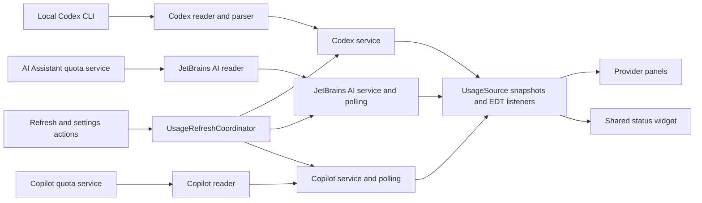

# Code structure

Source packages are rooted at `io.github.larsnoerber.agentsusage`.
Provider code is grouped by feature, so a provider change can be understood in one place.

```text
Agents Usage/
├── AGENTS.md                         Project rules
├── README.md                         Installation and usage
├── CHANGELOG.md                      Release history
├── docs/
│   ├── ARCHITECTURE.md               Packages, responsibilities, and data flow
│   ├── DEVELOPMENT.md                Build, development IDE, and integration notes
│   ├── MARKETPLACE.md                Listing preview and media upload instructions
│   └── images/                       Illustrated listing assets (PNG and editable SVG)
├── tools/                           Documentation asset renderer
├── build.gradle.kts                 Build and plugin release metadata
├── settings.gradle.kts              Gradle project identity
├── gradle/                          Gradle wrapper
└── src/main/
    ├── kotlin/io/github/larsnoerber/agentsusage/
    │   ├── application/             Coordinates actions across all providers
    │   ├── core/
    │   │   ├── UsageSource.kt        UI-facing snapshot/listener contract
    │   │   ├── format/              Subscription labels, dates, and countdowns
    │   │   ├── reflection/          Optional plugin discovery and API getters
    │   │   └── refresh/             Shared background polling
    │   ├── providers/
    │   │   ├── codex/               CLI transport, JSON parsing, model, and service
    │   │   │   └── ui/              OpenAI panel, countdown card, and status factory
    │   │   ├── jetbrainsai/          AI Assistant reader, credit model, and service
    │   │   │   └── ui/              Credit panel and status factory
    │   │   └── copilot/             Copilot reader, quota model, and service
    │   │       └── ui/              Quota panel and status factory
    │   ├── settings/                Persisted choices and IDE Settings page
    │   └── ui/
    │       ├── components/          Bars, headers, tooltips, toolbar, and status widget
    │       ├── settings/            Refresh presets and custom interval controls
    │       └── toolwindow/          IntelliJ factory, composition, and page navigation
    └── resources/
        ├── META-INF/               Plugin registrations and plugin logo
        └── icons/                  Small Tool Window icon
```

`build/`, `.gradle/`, `.intellijPlatform/`, `.kotlin/`, and `.idea/` are generated local directories.
They are not part of the source architecture and remain ignored by Git.

## Responsibilities

| Area                                  | Owns                                                                                   | Does not own                                |
|---------------------------------------|----------------------------------------------------------------------------------------|---------------------------------------------|
| `providers/<provider>/*UsageReader`   | Provider transport/API access and snapshot conversion                                  | Swing rendering                             |
| `providers/<provider>/*UsageService`  | Current snapshot, refresh, listener delivery, and disposal                             | Cross-provider UI actions                   |
| `core/refresh/UsagePolling`           | Frequent local reads, throttled refresh requests, serialization, and listener dispatch | Provider details or settings lookup         |
| `application/UsageRefreshCoordinator` | Refresh all, apply interval, restart CLI timer, and refresh optional providers         | Persisted storage or rendering              |
| `settings/AgentsUsageSettings`        | CLI path, interval bounds, persistence, and existing storage identifiers               | Starting services                           |
| `providers/<provider>/ui`             | Provider labels, bars, subscription details, and UI listeners                          | Provider network/process operations         |
| `ui/components/UsageStatusBarWidget`  | Shared status layout, clicks, tooltips, and subscription cleanup                       | Provider formatting                         |
| `ui/toolwindow/AgentsUsagePanel`      | Composing installed provider panels and switching pages                                | Parsing snapshots or owning provider timers |

## Data flow



Codex has an interval-based timer because a refresh starts a CLI process. Its reader owns process timeouts and cleanup.
AI Assistant and Copilot are polled locally every five seconds; their remote refresh requests respect the shared
interval.
The interval lookup is supplied to `UsagePolling` by the provider services, keeping core independent of settings.

Reader work runs on background threads. Services publish UI updates through the event dispatch thread.
Each panel/widget removes its listener during disposal; the Codex panel additionally stops its countdown timer.

## Adding or changing a provider

1. Read the rules in `AGENTS.md` and keep the work within the provider's folder.
2. Use an immutable usage snapshot and a service implementing `UsageSource<T>`.
3. Keep optional/internal API access in the reader. Reuse `PluginApi` for reflected getters.
4. Use shared bars and headers in the provider panel, and return a `StatusBarPresentation` from the status factory.
5. Add available providers to Tool Window composition and the refresh coordinator.
6. Register factories in `src/main/resources/META-INF/plugin.xml` and update the documentation.

## Compatibility identifiers

Package locations may change; these identifiers preserve the existing user configuration:

| Purpose                    | Identifier                               |
|----------------------------|------------------------------------------|
| Plugin                     | `io.github.larsnoerber.agentsusage`      |
| Tool Window                | `Agents Usage`                           |
| OpenAI widget              | `CodexUsageStatusBar`                    |
| JetBrains AI widget        | `JetBrainsAiCreditsStatusBar`            |
| Copilot widget             | `GitHubCopilotUsageStatusBar`            |
| Settings component/storage | `CodexUsageSettings` / `codex-usage.xml` |
