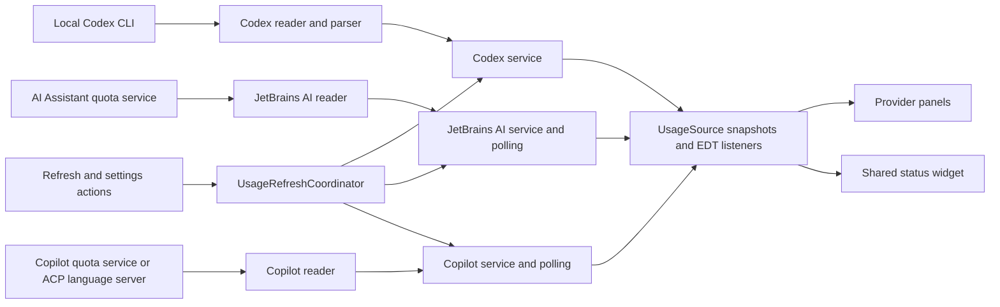

# Code structure

Scope: Rider/JetBrains, standalone Windows, VS Code and Visual Studio are separate applications in one repository.
See the [documentation index](README.md) and [provider matrix](PROVIDERS.md) for edition availability. The shared
version and persisted identifiers remain unchanged by the Windows source refactoring.

### Windows source organization

The standalone WPF app keeps the XAML window types and event handler names stable while organizing their partial
classes by responsibility:

- `UI/MainWindow.xaml.cs`: composition, dashboard updates and shared window state.
- `UI/MainWindow.Settings.cs`: settings navigation, provider activation and applying saved choices.
- `UI/MainWindow.Connections.cs`: official sign-in actions, masked key input and connection labels.
- `UI/MainWindow.Widget.cs`: persisted widget preferences and dashboard/tray navigation.
- `UI/MainWindow.Lifecycle.cs`: closing/minimizing behavior and cleanup of callbacks, timers and processes.
- `UI/DesktopWidgetWindow.cs`: window composition and applying widget preferences; its `.Menu`, `.Interaction`
  and `.Presentation` parts own menu actions, gestures, and complete-batch rendering respectively.

`Core/ProviderIds` owns only stable persisted identifiers. `UI/Components/ProviderCatalog` owns names, compact labels
and colors shared by dashboard, bar, popup and provider ordering. Core does not import UI, settings or provider
implementations. `Settings/UsageSettings` is the choice model; `Settings/SettingsStore` owns JSON persistence and
normalization. `GetExecutablePath` returns a saved choice without discovering or starting processes.

`Application/UsageRefreshCoordinator` owns scheduling, serialization and cancellation generations. Its `.Readers`
part shares the background read/cache/publication path between batch refresh and connection monitoring; `.Login`
owns cross-provider sign-in coordination. Copilot's protocol-specific device flow lives in
`Providers/Copilot/CopilotSignIn`. OpenCode CLI response parsing lives in `Providers/OpenCode/OpenCodeStatistics`.
`Core/History/UsageSnapshotStore` retains the existing `saved-usage.json` schema and filename. Refactoring preserves
settings identifiers and UI event bindings. The WPF sources are not indexed in the currently open Kotlin/Gradle
Rider project; source refactoring is used after the IDE rejected the symbol operation without modifying files.

`Packaging/AgentMeter.svg` is the user-supplied icon source. `Packaging/read-icon.ps1` translates its supported
shapes, gradients and transforms into WPF vector geometry. `render-assets.ps1` generates each ICO/PNG size directly
from this geometry. The EXE, window and tray share the embedded ICO; Store assets use the same source. MSBuild
tracks both the SVG and renderer scripts so changed artwork regenerates the assets.

### Windows widget refresh presentation

`UI/Components/WidgetRefreshStatus` renders themed refresh text and progress for the selected bar providers.
MainWindow forwards the coordinator's full-refresh busy state to DesktopWidgetWindow. The widget buffers incoming
snapshots during the refresh, hides provider segments, disables auto-collapse while loading, and commits the batch
when refresh finishes. Startup waits for the first completed refresh rather than exposing providers individually or
treating restored saved usage as a completed live read. A provider result may contain live usage, saved values, or
an unavailable notice; unavailable providers do not hold the loading display indefinitely. Targeted sign-in updates
continue to update normally outside a full refresh. Polling and visibility preferences remain unchanged.

### Windows OpenCode, Junie and saved usage

`windows/Providers/OpenCode/OpenCodeReader` uses the official CLI's `auth list` and `stats --days 30 --tools 0`.
For version 2 it uses `auth list --format json` (connection metadata, not `auth export`) and
`stats --days 30 --json`, publishing only connection presence and numeric cost/token fields. Executable detection
includes OpenCode Desktop's roaming versioned CLI and its bundled resource executable, avoiding the GUI binary.
Version 2 command reference: https://opencode.ai/v2/docs/cli/commands/.
`Core/Processes/AgentStatistics` shares the actual credential-count/table parsing with Kilo. OpenCode local costs
and tokens are independent of account quota or remaining provider credit. Official commands own credentials and
AgentMeter does not copy them into configuration. CLI semantics: https://opencode.ai/docs/cli/.

`windows/Providers/Junie/` owns its ACP connection and statistics parser. It initializes one bounded subprocess,
creates a session, and requires the advertised `stats` command with Junie's built-in statistics description before
submitting `/stats`. No ordinary model task is submitted. Client file/terminal/permission requests are refused;
stderr is drained without retaining or logging it. The session is reused for subsequent polling, reset after a failed
read or changed executable/project, and terminated on deselection/disposal. Authentication-required responses
produce Not connected and an official CLI sign-in action. Installed ACP native Junie executables are found without
launching Rider. Rider authentication may not provide a standalone CLI login. Balance is reported only when the
command returns it; saved all-time usage applies to the selected project, defaulting to the user home directory.
CLI command reference: https://junie.jetbrains.com/docs/slash-commands.html.

`Core/History/UsageSnapshotStore` persists measured quota percentages, reset times and constrained numeric display
values
to `%LOCALAPPDATA%/AgentMeter/saved-usage.json` using atomic replacement. It excludes credentials, raw responses,
account details, plan text and authentication state. The coordinator restores selected providers immediately on
startup and falls back to saved values when a refresh reports no measurements. `UsageSnapshot.IsCached` prevents
cached data from being treated as authentication; UI notices/widget freshness retain the original observation time.
Live authentication status remains separate. Saved selections are preserved when adding both provider IDs.
After launching Junie/OpenCode/Cline/Kilo sign-in, MainWindow starts the coordinator's bounded readiness monitor
while leaving the terminal and settings usable. The coordinator serializes its targeted refreshes with ordinary polling,
honors selected providers and generations, and dispatches updates on the UI thread. Monitoring ends on a verified
connection, disposal, or the three-minute deadline; a CLI terminal need not exit to update Connected.

Windows Cline connection detection uses `Providers/Cline/auth-status.mjs`, copied alongside the published app.
`ClineConnection` locates the installed SDK next to the detected CLI and runs it with Node in a bounded process job.
The official SDK evaluates provider readiness; the helper returns only a nullable boolean and suppresses logs.
Kilo independently reads its CLI credential inventory, so a BYOK connection is not mistaken for a missing Gateway
login. Connection availability and numeric usage history remain separate fields in provider snapshots.
`WidgetVisibleProviders` is an optional independent visibility list. Null retains the previous behavior of showing
enabled providers; an empty list intentionally shows none. Appearance composes named provider checkboxes, and the
widget intersects this selection with `EnabledProviders`. Dashboard/provider polling selection remains independent.

The standalone Windows app also groups `Providers/Kilo` and `Providers/Cline` independently. Kilo delegates read-only
profile/statistics requests to its installed official CLI through `Core/Processes/ReadOnlyAgentCommand`, with bounded
output, cancellation, timeouts and a Windows process job. Authentication remains owned by Kilo. The reader publishes
only the reported numeric balance and statistics, never profile identity fields or raw process output. A failed balance
request is unavailable rather than zero. Cline selects only numeric usage fields from the official `sessions.db` in
read-only mode, honoring Cline's storage environment overrides; it sums each session's own usage once, including
subagents, instead of combining parent aggregate totals with child records. Local history does not establish sign-in.
Both use the existing coordinator, selection settings, provider pages and all widget styles; existing selections remain
unchanged on upgrade. Money/token observations carry `UsageQuota.DisplayValue`, not manufactured quota percentages.

Source packages are rooted at `io.github.larsnoerber.agentsusage`.
Provider code is grouped by feature, so a provider change can be understood in one place.

```text
AgentMeter/
├── AGENTS.md                         Project rules
├── README.md                         Installation and usage
├── CHANGELOG.md                      Release history
├── docs/
│   ├── ARCHITECTURE.md               Packages, responsibilities, and data flow
│   ├── DEVELOPMENT.md                Build, development IDE, and integration notes
│   ├── MARKETPLACE.md                Listing preview and media upload instructions
│   └── images/                       Illustrated listing assets (PNG and editable SVG)
├── tools/                           Documentation asset renderer
├── build.gradle.kts                 JetBrains build and aggregate multi-extension build
├── settings.gradle.kts              Repository configuration and project name lookup
├── gradle.properties                Central project identity, version, and daemon settings
├── gradlew / gradlew.bat             Gradle launchers for POSIX / Windows
├── gradle/wrapper/                   Wrapper bootstrap and pinned distribution settings
├── .gitattributes                   Wrapper and properties line endings
├── src/main/
    ├── kotlin/io/github/larsnoerber/agentsusage/
    │   ├── application/             Coordinates actions across all providers, including local weekly insights
    │   ├── core/
    │   │   ├── UsageSource.kt        UI-facing snapshot/listener contract
    │   │   ├── format/              Subscription labels, dates, and countdowns
    │   │   ├── agents/              Installed ACP registry agent detection
    │   │   ├── reflection/          Optional plugin discovery and API getters
    │   │   └── refresh/             Shared background polling
    │   ├── providers/
    │   │   ├── codex/               CLI transport, JSON parsing, model, and service
    │   │   │   └── ui/              OpenAI panel, countdown card, and status factory
    │   │   ├── jetbrainsai/          AI Assistant reader, credit model, and service
    │   │   │   └── ui/              Credit panel and status factory
    │   │   └── copilot/             Copilot reader, quota model, and service
    │   │       └── ui/              Quota panel and status factory
    │   ├── settings/                Persisted choices and IDE Settings page
    │   └── ui/
    │       ├── components/          Bars, headers, tooltips, toolbar, and status widget
    │       ├── settings/            Refresh presets and custom interval controls
    │       └── toolwindow/          IntelliJ factory, composition, and page navigation
    └── resources/
        ├── META-INF/               Plugin registrations and plugin logo
        └── icons/                  Small Tool Window icon
├── vscode/                         VS Code extension (TypeScript, its own API and package)
    ├── package.json                VS Code manifest and npm build scripts
    └── src/                        Extension activation, Codex and Copilot readers, and quota webview
└── visualstudio/                   Visual Studio 2022/2026 extension (C#, stable VSSDK, WPF)
    ├── AgentsUsagePackage.cs        Package registration and opening the usage window
    ├── Providers/Codex/            CLI reader and provider-reported quota snapshot
    ├── Core/Processes/             Process-tree lifetime through Windows job objects
    ├── Settings/                   Visual Studio Options page and saved user choices
    ├── UI/                         Native tool window, quota bars and refresh lifecycle
    └── build.ps1                   Shared-version MSBuild packaging into dist/
```

`build/`, `.gradle/`, `.intellijPlatform/`, `.kotlin/`, and `.idea/` are generated local directories.
They are not part of the source architecture and remain ignored by Git.

The VS Code extension shares the repository, release version, provider definitions, and product documentation with
the JetBrains plugin. Its editor integration and provider readers live under `vscode/` because the VS Code Extension
API and Node.js process model differ from the IntelliJ Platform APIs. Codex reads reported quota through the local
Codex CLI app-server. Copilot reads GitHub's internal quota endpoint using VS Code's GitHub authentication. Neither
provider estimates usage from local activity; the Copilot endpoint is not a supported public API and can change.
The sidebar renders provider-reported values in a themed WebviewView so quota percentages and bars can use quota
colors; provider selection and refresh settings remain in VS Code's native Settings UI.
Quota bars use native progress elements and CSS classes within the webview's nonce-authorized stylesheet. The Activity
Bar uses a transparent, monochrome version of the Rider AI monogram; Marketplace artwork retains the colored logo.
Copilot selects chat for Free plans, skips empty 0/0 snapshots, and keeps unlimited categories separate from finite
consumption percentages. A missing premium balance is not inferred from unlimited basic chat or completions.

The Visual Studio package uses the stable Visual Studio 2022 SDK, .NET Framework 4.7.2 and native WPF controls.
Its VSIX manifest targets Community, Professional and Enterprise from API version 17.0 onward on Windows x64,
including Visual Studio 2026. These are declared installation targets; runtime behavior needs IDE checks.
Visual Studio provider readers, models and UI live in `visualstudio/Providers/<Provider>/`. Copilot reflects only the
loaded optional `Microsoft.VisualStudio.Copilot` quota contract and gets a disposable proxy from the shell's brokered
service container. It reads `GetQuotasAsync`, matching Visual Studio's own quota UI; it never queries token/account
services. No required Copilot dependency is registered. Free plans select included chat; paid plans select premium
quota. Empty 0/0 placeholders are skipped, unlimited categories stay separate, and absent quotas are unavailable.
`visualstudio/Application/UsageRefreshCoordinator` owns readers, snapshots, cancellation and a single dispatcher timer.
Both the usage view and status indicator subscribe to it. Reads run off the UI thread; listener delivery and WPF
updates run on the dispatcher. Windows job objects stop Codex process trees on timeout/disposal. Settings changes
cancel obsolete reads and pause deselected providers. Closing the window pauses polling when the status indicator
is disabled. Light background package autoload makes the indicator available without first opening the tool window.
`UI/StatusBarHost` isolates insertion into the shell's WPF `StatusBarPanel`; this is a version-dependent UI attachment,
not an official generic status-widget API. It leaves shell status text alone, detaches on disposal/disable, and stays
absent if the insertion point is missing. Standard toolbar/menu commands use a custom AI image moniker. These shell
and Copilot integrations need live IDE checks across versions. No credentials or prompt history are read or logged.
`visualstudio/Marketplace/` stores descriptions, publishing metadata and explicitly illustrated example images.
The Visual Studio build creates a versioned, self-contained Marketplace upload folder/archive beside its VSIX.
HTML image links target the release tag; Markdown uses publish-manifest image assets. No publishing occurs in Build.
Visual Studio 1.0.15 intentionally migrates the legacy VSIX identity `lanoerber.AgentsUsage.VisualStudio` to
`lanoerber.AgentsUsage.VisualStudio.82441438-356a-4f3a-a82f-47bc9e090b7e`, following explicit user approval after
deletion
of the old listing. The new Marketplace internal name is `agents-usage-visualstudio`. Package, command, window and
settings identifiers remain stable; remove the old VSIX before installing the new identity to avoid duplicate package
registration. Future updates must retain the new VSIX ID. Upload details derive identity from the manifest.

## Responsibilities

### Standalone Windows application

`windows/` is a separate .NET 10 WPF application, published as a self-contained Windows executable.
`App` explicitly creates the dashboard on normal startup. Its opt-in `--diagnose-gemini` startup path reads quotas
from the packaged runtime without creating a window and exports only safe quota metadata and exception types locally.
`Providers/<Provider>/` contains standalone readers/adapters, `Core/` contains immutable snapshots, JSON fields,
bounded provider HTTP and executable discovery, `Settings/` persists choices, and `UI/` composes the native window.
`Application/UsageRefreshCoordinator` owns provider instances, cancellation, refresh serialization and dispatcher
delivery. Deselection cancels obsolete reads. Closing/minimizing the dashboard hides it to a branded system tray icon;
polling remains active. Explicit Exit disposes tray resources, timers and quota process trees.
The coordinator pauses polling during Copilot's official device login, then reloads quotas. `AgentLogin` launches
official interactive CLI logins or fixed provider installation pages. Credentials never enter app settings or snapshots.

The Windows project links the existing Visual Studio Codex reader/model and Win32 process-job source files, which
have no IDE SDK dependency, rather than duplicating that transport. All editor registrations and package identities
remain in their own projects. Claude/Cursor port the same official-store quota protocols as the Kotlin readers;
HTTP requests have fixed provider destinations, bounded bodies, timeouts and no redirects. Copilot asks an installed
official Language Server through LSP `checkQuota` and delegates sign-in/token storage to that server.
Existing ACP packages are optional executable discovery locations; no running JetBrains IDE is required.
JetBrains AI is excluded from the Windows provider list; legacy saved selections are filtered when loaded.
Gemini reads the official CLI `.gemini/oauth_creds.json` Google session (respecting `GEMINI_CLI_HOME`) only for fixed
Google Code Assist `loadCodeAssist` health and `retrieveUserQuota` calls. Provider-local configuration/parser files
handle the OAuth mode, Cloud project, reported model buckets, fractions and reset times. Workspace project choice
comes from app Settings, inherited Google project environment variables or the CLI's own user `.env` file.
The CLI owns interactive Google login and token renewal; encrypted-only CLI stores are unsupported. When CLI quota
data is unavailable, the Gemini provider may fall back to the two session cookies in the standalone Gemini app's
profile or an Edge profile and its private `gemini.google.com` usage RPC. `GeminiAppCookieReader` is provider-local,
restricts
cookie names/domains and supports DPAPI plus Chromium v10 decryption; app-bound v20 cookies fail closed. Cookies are
sent only to Gemini and never stored by AgentMeter. This web quota is labeled Gemini Apps and remains distinct from
Code Assist/API quotas.
The web reader checks each readable local session until a profile reports quotas. A missing HTML session token does
not establish sign-in; the usage RPC determines whether Google accepts the cookies, and rejected sessions allow the
next local profile to be tried.
When the Gemini desktop app exclusively opens its cookie file, `GeminiCookieFile` locates the exact official-store
file handle in processes beneath the installed Google/Gemini directory. It duplicates read access only, maps the
encrypted file read-only without moving the app's file pointer, and bounds handle enumeration and snapshot size.
`GeminiCookieDatabase` opens that snapshot as read-only SQLite in RAM, validates integrity, and clears/frees the
buffers on disposal. No process memory, file writes, elevated privileges or app termination are used. Active rollback
journals, outstanding WAL frames and changing snapshots defer the read to the next refresh; v20 encryption still fails
closed. The web reader retains only reported numeric snapshots for at most 24 hours across transient failures, with
the original update time and an explicit stale-data notice. Credential material is reacquired for each request.
Only choices (CLI executable and project ID) enter app settings. Core HTTP supports JSON POST bodies without
importing Gemini models. Grok is not included in the standalone Windows app. New providers are available in selection
settings without overwriting saved choices.
Claude uses a bounded official CLI authentication-status probe when subscription credentials are absent, distinguishing
API-key sign-in from subscription quota availability. Nullable snapshot authentication state preserves a known login
across transient transport failures. Login buttons hide once authenticated; official agents persist their own sessions.
Standalone settings live in `%LOCALAPPDATA%/AgentMeter/windows-settings.json` and have independent identifiers.
`UI/DesktopWidgetWindow` renders the same selected snapshots as colored status text in a movable borderless window.
The persisted `WidgetStyle` choice switches between Classic, Compact, Cards, Circles, Vertical and Mini presentations.
`UI/Components/WidgetColors` defines five independent desktop color palettes, persisted as `WidgetColorStyle`
and applied immediately through dashboard settings or the widget context menu. Warning colors keep their quota
meaning across palettes. Cards and Circles normalize provider badge heights after measuring their natural content.
`UI/Components/WidgetProviderContent` builds the presentation and `QuotaRing` draws quota arcs and percentage text;
provider buttons remain stable across style and snapshot changes to preserve popup and drag behavior. Style selection
in Settings and the widget context menu applies immediately without restarting provider readers or timers.
`UI/Components/WidgetOptionsPanel` edits snap, position lock, countdown/freshness visibility, auto-collapse and
provider order through transformations of the dashboard's current settings. These display changes do not restart
provider readers. `WidgetPlacement` constrains/snaps on the current monitor, and `WidgetTimeText` formats only
reported reset times and determines whether updates are overdue. Mini keeps reset times in click details to remain
small. The existing dashboard minute timer refreshes widget time labels; no independent quota polling is added.
A short UI-only collapse timer runs after pointer exit, pauses for menus/details/drags, and stops on shutdown.
It persists position, display mode, pin settings, opacity and behavior choices; hover expands the collapsed handle.
Provider segments have dividers and `UI/Components/WidgetTooltip` composes dark quota content for an above-bar click
popup. Segment buttons distinguish click, drag and double-click; hovering does not open details. Stable segment
instances preserve the popup's placement target while snapshots refresh. Hiding, dragging or deselecting closes it.
A separate ridged Thumb on the left owns dragging, dismisses popup capture before taking mouse capture, and saves
the final position. Popup placement uses the current monitor's work area and DPI to open below when space above
cannot fit the measured details content.
`UI/Components/ProviderCard` uses subscription badges to toggle supplemental details and `UsageHistoryChart` without
repeating the quota meters already visible on the collapsed card. The dashboard uses a black surface, compact cards,
grouped settings and restrained accent colors.
`Core/History/UsageHistory`
retains bounded numeric quota observations for 24 hours in memory, converting remaining quota to consumption for charts.
Refresh/countdown repainting preserves expansion and does not duplicate history samples. `UI/TrayHost` owns NotifyIcon
and menu resources; WinForms supplies tray integration and monitor work-area lookup. The WPF dashboard uses custom
dark window chrome.
`Packaging/` owns the reserved Store identity, desktop full-trust MSIX manifest, vector logos and listing/privacy
drafts. The vector logo is rendered into a multi-resolution ICO during build for the EXE, windows and tray.
`windows/build-msix.ps1` restores pinned Microsoft SDK build tools, renders logos and packages the self-contained
application with MakeAppx validation. It does not sign, install, upload or submit the package.
`windows/build.ps1` reads the shared repository version and publishes only the normal self-contained app folder;
it does not produce portable archives or runtime-dependent variants.
`buildAllExtensions` keeps its existing editor-package scope. See `windows/README.md` for account prerequisites.

| Area                                  | Owns                                                                                   | Does not own                                |
|---------------------------------------|----------------------------------------------------------------------------------------|---------------------------------------------|
| `providers/<provider>/*UsageReader`   | Provider transport/API access and snapshot conversion                                  | Swing rendering                             |
| `providers/<provider>/*UsageService`  | Current snapshot, refresh, listener delivery, and disposal                             | Cross-provider UI actions                   |
| `core/refresh/UsagePolling`           | Frequent local reads, throttled refresh requests, serialization, and listener dispatch | Provider details or settings lookup         |
| `application/UsageRefreshCoordinator` | Refresh all, apply interval, restart CLI timer, and refresh optional providers         | Persisted storage or rendering              |
| `settings/AgentsUsageSettings`        | CLI path, interval bounds, persistence, and existing storage identifiers               | Starting services                           |
| `providers/<provider>/ui`             | Provider labels, bars, subscription details, and UI listeners                          | Provider network/process operations         |
| `ui/components/UsageStatusBarWidget`  | Shared status layout, clicks, tooltips, and subscription cleanup                       | Provider formatting                         |
| `ui/toolwindow/AgentsUsagePanel`      | Composing selected, installed provider panels and switching pages                      | Parsing snapshots or owning provider timers |

## Data flow



Codex has an interval-based timer because a refresh starts a CLI process. Its reader owns process timeouts and cleanup.
AI Assistant and Copilot are polled locally every five seconds; their remote refresh requests respect the shared
interval.
The interval lookup is supplied to `UsagePolling` by the provider services, keeping core independent of settings.

Reader work runs on background threads. Services publish UI updates through the event dispatch thread.
Each panel/widget removes its listener during disposal; the Codex panel additionally stops its countdown timer.

`AgentSelectionPanel` shares the persisted provider checkboxes between IDE Settings and the Tool Window configuration.
It displays a notice beneath each missing ACP agent with instructions to install it through Rider's ACP Registry.
Notices refresh when configuration is opened/reset and hide once the package is present. Configuration has no
installation buttons or plugin-download workflow.
`core/agents/AcpAgentInstallation` detects installed registry packages under the IDE
system path without reading authentication data. Both configuration pages expose Weekly and Games checkboxes for
overview sections.
`UsageRefreshCoordinator` applies changes, notifies overview listeners on the EDT,
and asks the IDE to reevaluate all five status widget factories. The overview creates only selected, available
provider panels and disposes old panels when selection changes. Its toolbar remains available with no providers.
Deselected or unavailable providers skip background reads. JetBrains AI requires its optional plugin; Copilot uses
either the optional IDE quota service or its installed ACP language server. The overview also accepts installed ACP
packages for OpenAI,
Copilot, Claude and Cursor; missing packages do not create provider cards. Claude also accept their
loaded native IDE plugins. Claude and Cursor status widgets additionally require the local source their
current reader can use. Installed agents without usable sign-in/history show an explicit unavailable explanation.
An installed package and account login do not imply a finite account quota. Claude API-key logins are identified
through the official CLI; local logs remain readable even without subscription OAuth credentials.

`AgentSection` provides compact bordered surfaces and provider identity accents. `ProviderHeader` shows subscription
badges as accessible buttons, and `UsageSummary` shows four compact key/value facts and an expandable list of further
details.
Clicking the badge toggles the summary's details and chart; there is no separate details link. Expansion
survives provider refreshes; provider panels supply all labels and values. HTML labels and tooltips escape provider
text. The scrollable overview
tracks the viewport width. Shared status widgets render neutral labels and quota-colored values without dots.

`application/UsageInsightsService` observes only selected provider snapshots. It stores
daily starting and lowest remaining percentages with local sample times for the last seven days in
`agents-usage-insights.xml`; this history stays local and contains no credentials, prompts, or request details. The
collapsible overview panel renders a heatmap, provider lineup, tactical forecast, and a weekly rotating boss with phase
changes and a short, aggregated battle log. Battle event text wraps to the available Tool Window width. The tactical
forecast requires at least an hour and three percentage points
of
observed change, and it skips quotas expected to reset first. Reset celebrations briefly highlight the matching
provider in the lineup. Quota use and forecast values are estimates, not activity counts or comparable quota amounts.

`UsageStatusBarGroup` repositions the existing widgets after installation/removal on the EDT, keeping the visible
agents adjacent in OpenAI, JetBrains AI, Copilot order without changing their IDs or context-menu settings.
It uses the platform's status component layout and leaves unrelated widgets in their relative order. Extension
loading orders also define the same sequence. A different status bar implementation falls back to extension order.

`core/reflection/PluginClasses` first uses the loaded provider's class loader, then a specified loaded content
module's loader. The JetBrains AI quota and subscription readers share this compatibility path; core has no
provider-specific module names or service logic.
The JetBrains subscription reader prefers registered application services and the manager's immutable activation
snapshot. Its safe unavailable-reason field travels with the usage model to the provider's details/tooltips;
it contains only API metadata and exception types, never provider object contents or exception messages.

## Additional providers and usage details

`providers/cursor/` contains Cursor's immutable snapshot, local sign-in reader, throttled service,
consumption panel and widget.
`providers/claudecode/` retains the local monthly token scanner and adds subscription quota reads and a widget.
Their status widgets are shown only while the matching Rider ACP registry packages (`cursor`, `claude-acp`)
are present; Cursor additionally requires its local account source. Installation detection reads package paths only.
Provider readers use their
own official local login stores for requests to that provider, or delegate authentication to the native package.
All five providers are selected through `AgentSelectionPanel` and refreshed through `UsageRefreshCoordinator`.
Fresh Rider installations select only JetBrains AI, with Weekly and Games disabled. `AgentsUsageSettings` initializes
these choices separately from `AgentsUsageState`'s legacy constructor defaults so omitted XML fields preserve
existing selections. The existing `showClaudeCode` identifier is preserved. New widget identifiers
are `ClaudeCodeUsageStatusBar` and `CursorUsageStatusBar`; existing identifiers stay unchanged.

`core/storage/LocalUsageFiles` shares application-store path resolution and safe JSON field reads for Cursor
and Claude. Cursor reads only its official Agent/ACP auth JSON; no database driver or Desktop database fallback
is packaged. Cline support was removed for the first stable Marketplace release.
`core/http/UsageHttp`
provides bounded asynchronous HTTPS reads, cancellation, disabled redirects/cookie storage, and rate-limit backoff.
Only provider readers supply destinations and authentication headers; errors retain status codes rather than response
bodies, credentials, or exception messages. Services invoke these readers off the EDT and dispatch UI listeners via
`UsagePolling`. Network services cache snapshots between quota refreshes (Cursor >=60s, Claude >=180s).

`providers/copilot/GitHubCopilotAgentUsageReader` starts the installed package's native language server and reads
`checkQuota` over Content-Length-framed JSON-RPC. The server resolves its own existing ACP authentication; the plugin
does not receive credentials, start conversations, or issue prompts. Its process and descendants stop after the
request, on timeout, and on disposal. The parser skips empty quota placeholders and keeps paid premium quotas
separate from unlimited basic chat. `core/agents/AcpAgentInstallation.installedFile` resolves files from the newest
installed version and is shared with Claude's read-only native auth-status probe.

Cursor reads the official agent auth file (`%APPDATA%/Cursor/auth.json` on Windows, `~/.cursor/auth.json` on macOS,
and `$XDG_CONFIG_HOME/cursor/auth.json` or `~/.config/cursor/auth.json` on Linux).
Claude uses official subscription OAuth credentials where present. Otherwise `ClaudeAuthStatusReader` asks the
installed SDK binary for `auth status --json`, retaining only authentication mode and plan information. API-key
logins show local token usage with an explanation, without empty Pro/Max quota bars or a false sign-in request.
Claude's status widget requires the persisted selection and an installed package/plugin, without inspecting
credentials on the EDT. Without subscription quotas it shows recorded monthly tokens or the API connection state.
Absent local logs are displayed as unavailable rather than zero usage. Disabling the Claude checkbox still hides
both views and pauses reads.

`core/history/UsageHistory` stores only numeric, timestamped observations and reset markers in
`agents-usage-history.xml`, limited to 24 hours and 1800 observations per series. It imports no providers, settings or
UI. `ui/components/ProviderUsageDetails` supplies colored rows, countdown rings and `UsageHistoryChart`; `UsageSummary`
shows it inside the details toggled by the provider badge and preserves expansion across provider updates. Provider
panels supply metric names,
values, units and resets, record their observed snapshots, and dispose countdown timers with their subscriptions.
Charts show consumed quota percentages for finite quotas. Gaps over 15 minutes
and differing reset markers are not connected. No prior history is fabricated; collection starts while provider
panels exist. There is no credential, account identifier, prompt, task text, or provider-response history.

Weekly and Games activation is persisted separately from section expansion. The AgentMeter settings checkboxes call
the coordinator, which publishes feature changes to all open views. Disabling Weekly disposes its
view/listener/celebration timer;
the insights service continues provider baseline updates but skips progression while disabled. Games are detached
while disabled, retaining an unfinished board in the existing view and persisted scores across restarts.

The weekly boss now loses four HP per observed quota percentage point, starting with one-point hits. The largest
drop across a provider's session/weekly windows contributes once, and separate providers' hits add together. Actual
damage is persisted immediately. Claude and Cursor participate in the lineup and hits when finite quota percentages are
reported. Legacy current-week damage/daily observations are scaled once using `bossDamageVersion`.
Actual damage also produces bounded, transient `UsageBossHit` events with a sequence ID, provider, points and time.
The weekly panel uses them for provider-colored hit labels, an impact flash and a short boss shake. Events are not
persisted or inferred from restored damage or battle-log text. Duplicate IDs never replay; multiple provider hits
can remain visible together. The Swing animation timer runs only while the expanded weekly panel is showing, and
stops after the effects expire or the view is hidden, collapsed or disposed.
Repeating a snapshot, quota recovery, and resetting a quota do not deal damage. Forecast/heatmap fields retain their
existing semantics for the original providers.

## Adding or changing a provider

1. Read the rules in `AGENTS.md` and keep the work within the provider's folder.
2. Use an immutable usage snapshot and a service implementing `UsageSource<T>`.
3. Keep optional/internal API access in the reader. Reuse `PluginApi` for reflected getters.
4. Use shared bars and headers in the provider panel, and return a `StatusBarPresentation` from the status factory.
5. Add available providers to Tool Window composition and the refresh coordinator.
6. Register factories in `src/main/resources/META-INF/plugin.xml` and update the documentation.

## Compatibility identifiers

Package locations may change; these identifiers preserve the existing user configuration:

| Purpose                    | Identifier                               |
|----------------------------|------------------------------------------|
| Plugin                     | `io.github.larsnoerber.agentsusage`      |
| Tool Window                | `Agents Usage`                           |
| OpenAI widget              | `CodexUsageStatusBar`                    |
| JetBrains AI widget        | `JetBrainsAiCreditsStatusBar`            |
| Copilot widget             | `GitHubCopilotUsageStatusBar`            |
| Settings component/storage | `CodexUsageSettings` / `codex-usage.xml` |

The public product name is **AgentMeter** starting with 1.1.0. Plugin/package identifiers and the internal
Tool Window ID `Agents Usage` remain stable; the factory sets its visible title and stripe title to AgentMeter during
initialization.
`tools/package_jetbrains_marketplace.py` packages release-tagged listing copy and the reproducible PNG/SVG
gallery as a separate upload bundle; documentation images are not bundled into the Rider plugin.

### Windows OpenRouter integration

`windows/Providers/OpenRouter/` owns the official OpenRouter current-key quota reader, response parser and local
credential lookup. Credentials come from a directly entered session key, the explicitly saved current-user Windows
Credential Manager entry `AgentMeter/OpenRouter`, or the `openrouter` API-key entry in OpenCode's
official
`~/.local/share/opencode/auth.json` (or its `XDG_DATA_HOME` location); the bounded input buffer is cleared after
parsing. `OpenRouterKeyStore` uses WinCred generic credentials with local-machine persistence scoped to the current
Windows user, following the user's explicit request to retain entered keys. Keys never enter settings files or logs.
Native credential buffers are cleared before release. Directly entered session copies use disposable SecureString;
the PasswordBox clears on Connect. Remove saved key deletes the vault entry and disposes the session copy; exiting
disposes only the session copy. Windows/OpenCode keys are reacquired for each quota read. Authentication is sent only
to `https://openrouter.ai/api/v1/key`; management keys and profile/account identifiers are not requested or exposed.
The parser emits a remaining-budget percentage only when a finite key cap and reported remaining budget exist,
with an explicit zero for a zero spending cap. Uncapped keys show `No limit` for the key budget, plus
daily/weekly/monthly dollar-spend rows;
uncapped key budgets are not unlimited account credits. Reset policy is shown without a fabricated timestamp.
`UsageRefreshCoordinator` reads the provider off the UI thread only while selected. Dashboard and all widget styles
compose its normal snapshot. Existing provider selections stay unchanged; saved widget order appends the new ID.

Windows `UI/MainWindow.xaml` composes a settings navigation tree and separate instantiated panels for General,
widget Appearance/Behavior, and provider connections. Changing the selected tree leaf changes panel visibility;
inputs and session credentials are not recreated or discarded. Provider pages show a Connected status from
verified reader authentication, retaining known state across transient read failures. The code-behind handles navigation
and invokes
existing coordinator/login actions. Widget preferences remain immediate; executable/project/refresh edits apply
through Save settings. OpenRouter Connect on the dashboard selects its provider settings page and focuses the
masked session-key input.

`Core/UsageQuota.DisplayValue` carries reported non-percentage values such as OpenRouter dollar spend or an explicit
No limit key cap. Overview rows, widget text/rings and click details render these without a fabricated quota bar.
Connect and Save settings both consume a pending masked OpenRouter key through the coordinator.
