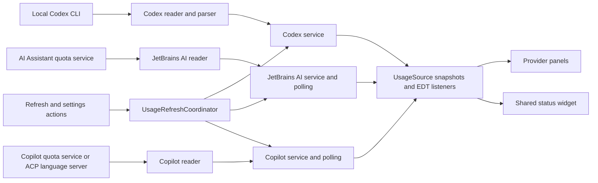

# Code structure

Source packages are rooted at `io.github.larsnoerber.agentsusage`.
Provider code is grouped by feature, so a provider change can be understood in one place.

```text
Agents Usage/
├── AGENTS.md                         Project rules
├── README.md                         Installation and usage
├── CHANGELOG.md                      Release history
├── docs/
│   ├── ARCHITECTURE.md               Packages, responsibilities, and data flow
│   ├── DEVELOPMENT.md                Build, development IDE, and integration notes
│   ├── MARKETPLACE.md                Listing preview and media upload instructions
│   └── images/                       Illustrated listing assets (PNG and editable SVG)
├── tools/                           Documentation asset renderer
├── build.gradle.kts                 JetBrains build and aggregate multi-extension build
├── settings.gradle.kts              Repository configuration and project name lookup
├── gradle.properties                Central project identity, version, and daemon settings
├── gradlew / gradlew.bat             Gradle launchers for POSIX / Windows
├── gradle/wrapper/                   Wrapper bootstrap and pinned distribution settings
├── .gitattributes                   Wrapper and properties line endings
├── src/main/
    ├── kotlin/io/github/larsnoerber/agentsusage/
    │   ├── application/             Coordinates actions across all providers, including local weekly insights
    │   ├── core/
    │   │   ├── UsageSource.kt        UI-facing snapshot/listener contract
    │   │   ├── format/              Subscription labels, dates, and countdowns
    │   │   ├── agents/              Installed ACP registry agent detection
    │   │   ├── reflection/          Optional plugin discovery and API getters
    │   │   └── refresh/             Shared background polling
    │   ├── providers/
    │   │   ├── codex/               CLI transport, JSON parsing, model, and service
    │   │   │   └── ui/              OpenAI panel, countdown card, and status factory
    │   │   ├── jetbrainsai/          AI Assistant reader, credit model, and service
    │   │   │   └── ui/              Credit panel and status factory
    │   │   └── copilot/             Copilot reader, quota model, and service
    │   │       └── ui/              Quota panel and status factory
    │   ├── settings/                Persisted choices and IDE Settings page
    │   └── ui/
    │       ├── components/          Bars, headers, tooltips, toolbar, and status widget
    │       ├── settings/            Refresh presets and custom interval controls
    │       └── toolwindow/          IntelliJ factory, composition, and page navigation
    └── resources/
        ├── META-INF/               Plugin registrations and plugin logo
        └── icons/                  Small Tool Window icon
├── vscode/                         VS Code extension (TypeScript, its own API and package)
    ├── package.json                VS Code manifest and npm build scripts
    └── src/                        Extension activation, Codex and Copilot readers, and quota webview
└── visualstudio/                   Visual Studio 2022/2026 extension (C#, stable VSSDK, WPF)
    ├── AgentsUsagePackage.cs        Package registration and opening the usage window
    ├── Providers/Codex/            CLI reader and provider-reported quota snapshot
    ├── Core/Processes/             Process-tree lifetime through Windows job objects
    ├── Settings/                   Visual Studio Options page and saved user choices
    ├── UI/                         Native tool window, quota bars and refresh lifecycle
    └── build.ps1                   Shared-version MSBuild packaging into dist/
```

`build/`, `.gradle/`, `.intellijPlatform/`, `.kotlin/`, and `.idea/` are generated local directories.
They are not part of the source architecture and remain ignored by Git.

The VS Code extension shares the repository, release version, provider definitions, and product documentation with
the JetBrains plugin. Its editor integration and provider readers live under `vscode/` because the VS Code Extension
API and Node.js process model differ from the IntelliJ Platform APIs. Codex reads reported quota through the local
Codex CLI app-server. Copilot reads GitHub's internal quota endpoint using VS Code's GitHub authentication. Neither
provider estimates usage from local activity; the Copilot endpoint is not a supported public API and can change.
The sidebar renders provider-reported values in a themed WebviewView so quota percentages and bars can use quota
colors; provider selection and refresh settings remain in VS Code's native Settings UI.
Quota bars use native progress elements and CSS classes within the webview's nonce-authorized stylesheet. The Activity
Bar uses a transparent, monochrome version of the Rider AI monogram; Marketplace artwork retains the colored logo.
Copilot selects chat for Free plans, skips empty 0/0 snapshots, and keeps unlimited categories separate from finite
consumption percentages. A missing premium balance is not inferred from unlimited basic chat or completions.

The Visual Studio package uses the stable Visual Studio 2022 SDK, .NET Framework 4.7.2 and native WPF controls.
Its VSIX manifest targets Community, Professional and Enterprise from API version 17.0 onward on Windows x64,
including Visual Studio 2026. These are declared installation targets; runtime behavior needs IDE checks.
Visual Studio provider readers, models and UI live in `visualstudio/Providers/<Provider>/`. Copilot reflects only the
loaded optional `Microsoft.VisualStudio.Copilot` quota contract and gets a disposable proxy from the shell's brokered
service container. It reads `GetQuotasAsync`, matching Visual Studio's own quota UI; it never queries token/account
services. No required Copilot dependency is registered. Free plans select included chat; paid plans select premium
quota. Empty 0/0 placeholders are skipped, unlimited categories stay separate, and absent quotas are unavailable.
`visualstudio/Application/UsageRefreshCoordinator` owns readers, snapshots, cancellation and a single dispatcher timer.
Both the usage view and status indicator subscribe to it. Reads run off the UI thread; listener delivery and WPF
updates run on the dispatcher. Windows job objects stop Codex process trees on timeout/disposal. Settings changes
cancel obsolete reads and pause deselected providers. Closing the window pauses polling when the status indicator
is disabled. Light background package autoload makes the indicator available without first opening the tool window.
`UI/StatusBarHost` isolates insertion into the shell's WPF `StatusBarPanel`; this is a version-dependent UI attachment,
not an official generic status-widget API. It leaves shell status text alone, detaches on disposal/disable, and stays
absent if the insertion point is missing. Standard toolbar/menu commands use a custom AI image moniker. These shell
and Copilot integrations need live IDE checks across versions. No credentials or prompt history are read or logged.
`visualstudio/Marketplace/` stores descriptions, publishing metadata and explicitly illustrated example images.
The Visual Studio build creates a versioned, self-contained Marketplace upload folder/archive beside its VSIX.
HTML image links target the release tag; Markdown uses publish-manifest image assets. No publishing occurs in Build.
Visual Studio 1.0.15 intentionally migrates the legacy VSIX identity `lanoerber.AgentsUsage.VisualStudio` to
`lanoerber.AgentsUsage.VisualStudio.82441438-356a-4f3a-a82f-47bc9e090b7e`, following explicit user approval after
deletion
of the old listing. The new Marketplace internal name is `agents-usage-visualstudio`. Package, command, window and
settings identifiers remain stable; remove the old VSIX before installing the new identity to avoid duplicate package
registration. Future updates must retain the new VSIX ID. Upload details derive identity from the manifest.

## Responsibilities

| Area                                  | Owns                                                                                   | Does not own                                |
|---------------------------------------|----------------------------------------------------------------------------------------|---------------------------------------------|
| `providers/<provider>/*UsageReader`   | Provider transport/API access and snapshot conversion                                  | Swing rendering                             |
| `providers/<provider>/*UsageService`  | Current snapshot, refresh, listener delivery, and disposal                             | Cross-provider UI actions                   |
| `core/refresh/UsagePolling`           | Frequent local reads, throttled refresh requests, serialization, and listener dispatch | Provider details or settings lookup         |
| `application/UsageRefreshCoordinator` | Refresh all, apply interval, restart CLI timer, and refresh optional providers         | Persisted storage or rendering              |
| `settings/AgentsUsageSettings`        | CLI path, interval bounds, persistence, and existing storage identifiers               | Starting services                           |
| `providers/<provider>/ui`             | Provider labels, bars, subscription details, and UI listeners                          | Provider network/process operations         |
| `ui/components/UsageStatusBarWidget`  | Shared status layout, clicks, tooltips, and subscription cleanup                       | Provider formatting                         |
| `ui/toolwindow/AgentsUsagePanel`      | Composing selected, installed provider panels and switching pages                      | Parsing snapshots or owning provider timers |

## Data flow



Codex has an interval-based timer because a refresh starts a CLI process. Its reader owns process timeouts and cleanup.
AI Assistant and Copilot are polled locally every five seconds; their remote refresh requests respect the shared
interval.
The interval lookup is supplied to `UsagePolling` by the provider services, keeping core independent of settings.

Reader work runs on background threads. Services publish UI updates through the event dispatch thread.
Each panel/widget removes its listener during disposal; the Codex panel additionally stops its countdown timer.

`AgentSelectionPanel` shares the persisted provider checkboxes between IDE Settings and the Tool Window configuration.
It displays a notice beneath each missing ACP agent with instructions to install it through Rider's ACP Registry.
Notices refresh when configuration is opened/reset and hide once the package is present. Configuration has no
installation buttons or plugin-download workflow.
`core/agents/AcpAgentInstallation` detects installed registry packages under the IDE
system path without reading authentication data. Both configuration pages expose Weekly and Games checkboxes for
overview sections.
`UsageRefreshCoordinator` applies changes, notifies overview listeners on the EDT,
and asks the IDE to reevaluate all six status widget factories. The overview creates only selected, available
provider panels and disposes old panels when selection changes. Its toolbar remains available with no providers.
Deselected or unavailable providers skip background reads. JetBrains AI requires its optional plugin; Copilot uses
either the optional IDE quota service or its installed ACP language server. The overview also accepts installed ACP
packages for OpenAI,
Copilot, Claude, Cursor and Cline; missing packages do not create provider cards. Claude and Cline also accept their
loaded native IDE plugins. Claude, Cursor and Cline status widgets additionally require the local source their
current reader can use. Installed agents without usable sign-in/history show an explicit unavailable explanation.
An installed package and account login do not imply a finite account quota. Claude API-key logins are identified
through the official CLI; local logs remain readable even without subscription OAuth credentials.

`AgentSection` provides compact bordered surfaces and provider identity accents. `ProviderHeader` shows subscription
badges as accessible buttons, and `UsageSummary` shows four compact key/value facts and an expandable list of further
details.
Clicking the badge toggles the summary's details and chart; there is no separate details link. Expansion
survives provider refreshes; provider panels supply all labels and values. HTML labels and tooltips escape provider
text. The scrollable overview
tracks the viewport width. Shared status widgets render neutral labels and quota-colored values without dots.

`application/UsageInsightsService` observes only selected provider snapshots. It stores
daily starting and lowest remaining percentages with local sample times for the last seven days in
`agents-usage-insights.xml`; this history stays local and contains no credentials, prompts, or request details. The
collapsible overview panel renders a heatmap, provider lineup, tactical forecast, and a weekly rotating boss with phase
changes and a short, aggregated battle log. Battle event text wraps to the available Tool Window width. The tactical
forecast requires at least an hour and three percentage points
of
observed change, and it skips quotas expected to reset first. Reset celebrations briefly highlight the matching
provider in the lineup. Quota use and forecast values are estimates, not activity counts or comparable quota amounts.

`UsageStatusBarGroup` repositions the existing widgets after installation/removal on the EDT, keeping the visible
agents adjacent in OpenAI, JetBrains AI, Copilot order without changing their IDs or context-menu settings.
It uses the platform's status component layout and leaves unrelated widgets in their relative order. Extension
loading orders also define the same sequence. A different status bar implementation falls back to extension order.

`core/reflection/PluginClasses` first uses the loaded provider's class loader, then a specified loaded content
module's loader. The JetBrains AI quota and subscription readers share this compatibility path; core has no
provider-specific module names or service logic.
The JetBrains subscription reader prefers registered application services and the manager's immutable activation
snapshot. Its safe unavailable-reason field travels with the usage model to the provider's details/tooltips;
it contains only API metadata and exception types, never provider object contents or exception messages.

## Additional providers and usage details

`providers/cursor/` contains Cursor's immutable snapshot, local sign-in reader, throttled service,
consumption panel and widget. `providers/cline/` contains local task-history/SDK metric reads, account credits, totals
and UI.
`providers/claudecode/` retains the local monthly token scanner and adds subscription quota reads and a widget.
Their status widgets are shown only while the matching Rider ACP registry packages (`cursor`, `cline`, `claude-acp`)
and provider-local sources are present. Installation detection reads package paths only. Provider readers use their
own official local login stores for requests to that provider, or delegate authentication to the native package.
All six providers are selected through `AgentSelectionPanel` and refreshed through `UsageRefreshCoordinator`.
Fresh Rider installations select only JetBrains AI, with Weekly and Games disabled. `AgentsUsageSettings` initializes
these choices separately from `AgentsUsageState`'s legacy constructor defaults so omitted XML fields preserve
existing selections. The existing `showClaudeCode` identifier is preserved. New widget identifiers
are `ClaudeCodeUsageStatusBar`, `CursorUsageStatusBar`, and `ClineUsageStatusBar`; existing identifiers stay unchanged.

`core/storage/LocalUsageFiles` shares application-store path resolution, safe JSON field reads, and read-only SQLite
access for Cursor and Cline. It never copies databases or reads arbitrary credential stores. The packaged SQLite
driver reads active WAL data; when sidecars are absent, immutable mode avoids creating them. `core/http/UsageHttp`
provides bounded asynchronous HTTPS reads, cancellation, disabled redirects/cookie storage, and rate-limit backoff.
Only provider readers supply destinations and authentication headers; errors retain status codes rather than response
bodies, credentials, or exception messages. Services invoke these readers off the EDT and dispatch UI listeners via
`UsagePolling`. Network services cache snapshots between quota refreshes (Cursor >=60s, Claude >=180s).

`providers/copilot/GitHubCopilotAgentUsageReader` starts the installed package's native language server and reads
`checkQuota` over Content-Length-framed JSON-RPC. The server resolves its own existing ACP authentication; the plugin
does not receive credentials, start conversations, or issue prompts. Its process and descendants stop after the
request, on timeout, and on disposal. The parser skips empty quota placeholders and keeps paid premium quotas
separate from unlimited basic chat. `core/agents/AcpAgentInstallation.installedFile` resolves files from the newest
installed version and is shared with Claude's read-only native auth-status probe.

Cursor prefers the official agent auth file (`%APPDATA%/Cursor/auth.json` on Windows, `~/.cursor/auth.json` on macOS,
and `$XDG_CONFIG_HOME/cursor/auth.json` or `~/.config/cursor/auth.json` on Linux), then its desktop database.
Claude uses official subscription OAuth credentials where present. Otherwise `ClaudeAuthStatusReader` asks the
installed SDK binary for `auth status --json`, retaining only authentication mode and plan information. API-key
logins show local token usage with an explanation, without empty Pro/Max quota bars or a false sign-in request.
Claude's status widget requires the persisted selection and an installed package/plugin, without inspecting
credentials on the EDT. Without subscription quotas it shows recorded monthly tokens or the API connection state.
Absent local logs are displayed as unavailable rather than zero usage. Disabling the Claude checkbox still hides
both views and pauses reads.
Cline reads `settings/providers.json` from its official CLI data root solely for requests to `api.cline.bot`.
`ClineAccountUsageReader` converts the signed account balance from micro-dollars to USD, matching Cline Hub. Credits
are displayed independently of recorded task costs; no percentage allowance is inferred. Account reads are
throttled to at least 60 seconds and cancelled on disposal. Credentials and account identifiers are never included
in snapshots, charts, logs, or persisted plugin settings.

`core/history/UsageHistory` stores only numeric, timestamped observations and reset markers in
`agents-usage-history.xml`, limited to 24 hours and 1800 observations per series. It imports no providers, settings or
UI. `ui/components/ProviderUsageDetails` supplies colored rows, countdown rings and `UsageHistoryChart`; `UsageSummary`
shows it inside the details toggled by the provider badge and preserves expansion across provider updates. Provider
panels supply metric names,
values, units and resets, record their observed snapshots, and dispose countdown timers with their subscriptions.
Charts show consumed quota percentages for finite quotas; Cline shows input/output token totals. Gaps over 15 minutes
and differing reset markers are not connected. No prior history is fabricated; collection starts while provider
panels exist. There is no credential, account identifier, prompt, task text, or provider-response history.

Weekly and Games activation is persisted separately from section expansion. The Agents Usage settings checkboxes call
the coordinator, which publishes feature changes to all open views. Disabling Weekly disposes its
view/listener/celebration timer;
the insights service continues provider baseline updates but skips progression while disabled. Games are detached
while disabled, retaining an unfinished board in the existing view and persisted scores across restarts.

The weekly boss now loses four HP per observed quota percentage point, starting with one-point hits. The largest
drop across a provider's session/weekly windows contributes once, and separate providers' hits add together. Actual
damage is persisted immediately. Claude and Cursor participate in the lineup and hits; Cline local tokens are not
converted into quota damage. Legacy current-week damage/daily observations are scaled once using `bossDamageVersion`.
Actual damage also produces bounded, transient `UsageBossHit` events with a sequence ID, provider, points and time.
The weekly panel uses them for provider-colored hit labels, an impact flash and a short boss shake. Events are not
persisted or inferred from restored damage or battle-log text. Duplicate IDs never replay; multiple provider hits
can remain visible together. The Swing animation timer runs only while the expanded weekly panel is showing, and
stops after the effects expire or the view is hidden, collapsed or disposed.
Repeating a snapshot, quota recovery, and resetting a quota do not deal damage. Forecast/heatmap fields retain their
existing semantics for the original providers.

## Adding or changing a provider

1. Read the rules in `AGENTS.md` and keep the work within the provider's folder.
2. Use an immutable usage snapshot and a service implementing `UsageSource<T>`.
3. Keep optional/internal API access in the reader. Reuse `PluginApi` for reflected getters.
4. Use shared bars and headers in the provider panel, and return a `StatusBarPresentation` from the status factory.
5. Add available providers to Tool Window composition and the refresh coordinator.
6. Register factories in `src/main/resources/META-INF/plugin.xml` and update the documentation.

## Compatibility identifiers

Package locations may change; these identifiers preserve the existing user configuration:

| Purpose                    | Identifier                               |
|----------------------------|------------------------------------------|
| Plugin                     | `io.github.larsnoerber.agentsusage`      |
| Tool Window                | `Agents Usage`                           |
| OpenAI widget              | `CodexUsageStatusBar`                    |
| JetBrains AI widget        | `JetBrainsAiCreditsStatusBar`            |
| Copilot widget             | `GitHubCopilotUsageStatusBar`            |
| Settings component/storage | `CodexUsageSettings` / `codex-usage.xml` |
