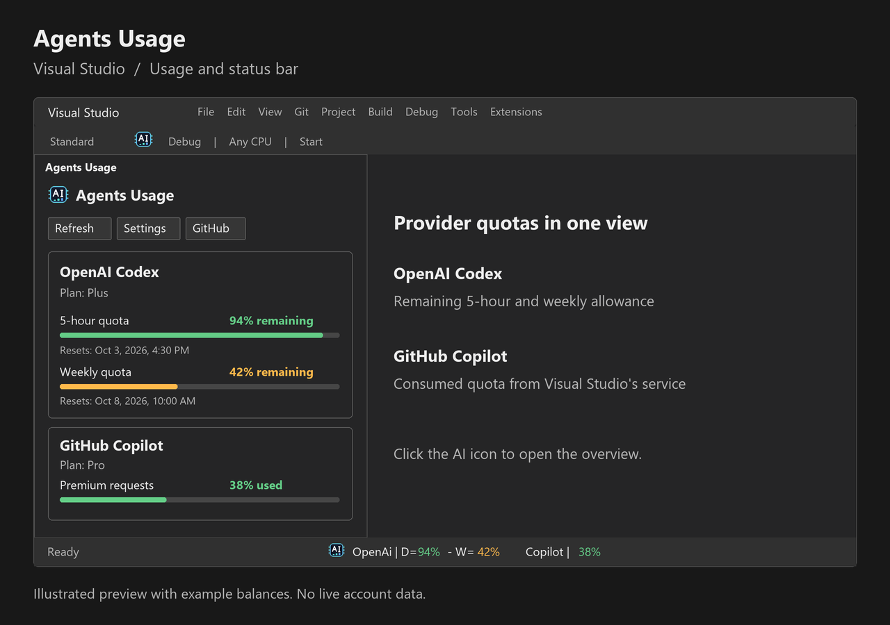
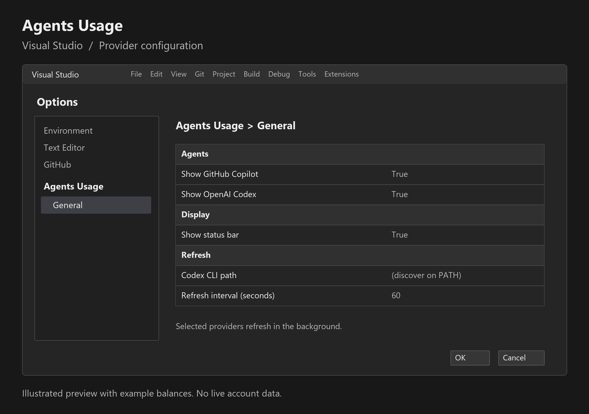

# AgentMeter for Visual Studio

Keep your AI quota in view while you work. AgentMeter displays **provider-reported allowance and consumption**
for OpenAI Codex and GitHub Copilot in a native Visual Studio tool window and the status bar.

*Illustrated preview with example balances. Actual values depend on the signed-in provider account.*

## Features

- **OpenAI Codex:** remaining 5-hour and weekly quotas, colored bars, subscription plan, credits and reset times.
- **GitHub Copilot:** consumed quota, reported subscription plan and reset times from Visual Studio's own Copilot
  service.
  Free plans use the included chat allowance; paid plans use premium allowance when reported. AI credit billing and
  unlimited categories are identified explicitly. Missing data is shown as unavailable.
- **At a glance:** a colored AI icon in the Standard toolbar, tool window and status bar. Click the toolbar or status
  indicator to open the Usage overview.
- **Color-coded percentages:** OpenAI shows the remaining balance; Copilot shows consumption (0% unused, 100%
  exhausted).
- **Refresh:** automatic background refresh and a manual Refresh action. Deselected providers are not read.
- **Configuration:** choose providers, toggle the status display, set a Codex CLI path and adjust the refresh interval.
- **Project information:** visible version and a direct GitHub repository link.

## Compatibility and requirements

- Visual Studio **2022 and 2026**, Community, Professional or Enterprise, on Windows x64.
- OpenAI quota requires an installed Codex CLI, already signed in with `codex login`. Leave the CLI path empty to use
  PATH.
- Copilot quota requires an installed, signed-in GitHub Copilot integration with a quota service. Open Copilot once if
  the service has not loaded yet. Older IDE/Copilot builds may not expose quota data.
- Copilot uses the installed integration's existing connection. No separate GitHub token is requested.
- Provider APIs can change. No quotas are estimated from local activity, and credentials and prompt history are not
  read or logged.
- JetBrains AI belongs to the JetBrains edition of this extension; it is not a Visual Studio provider.

## Getting started

**Migrating from AgentMeter 1.0.14 or earlier?** Uninstall that Visual Studio extension before installing 1.0.15.
The deleted Marketplace listing's identity has been replaced; this package is a new extension, not an automatic update.

1. Install **AgentMeter** for Visual Studio and complete the VSIX Installer's instructions.
2. Open **View > Other Windows > AgentMeter**, or click the AI button on the Standard toolbar.
3. Use **Settings** or **Tools > Options > AgentMeter > General** to choose providers and refresh settings.
4. Sign in to Codex/Copilot through their existing tools, then click **Refresh**.

*Illustrated configuration preview. Settings use Visual Studio's native Options dialog.*

Automatic refresh continues when the status indicator is enabled. If the indicator is disabled, refresh runs only
while the Usage view is visible. Quota colors follow exhaustion risk. Unlimited quotas have no exhaustion percentage.

The Visual Studio and VS Code downloads are different packages. Choose the **visualstudio** VSIX for Visual Studio;
the **vscode** VSIX is intended for Visual Studio Code.

## Source and support

- [Source code](https://github.com/larsnoerber/Rider_Agents_Usage)
- [Report an issue](https://github.com/larsnoerber/Rider_Agents_Usage/issues)
- [Release notes](https://github.com/larsnoerber/Rider_Agents_Usage/blob/main/CHANGELOG.md)

This independent extension is not affiliated with or endorsed by OpenAI, GitHub, Microsoft or JetBrains.
The extension is free; provider subscriptions and allowances are determined by each provider.
