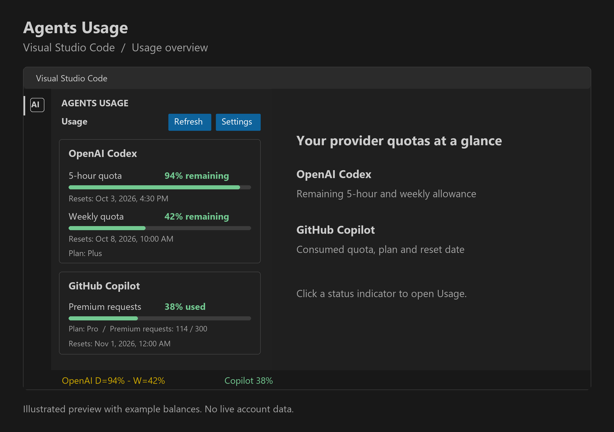
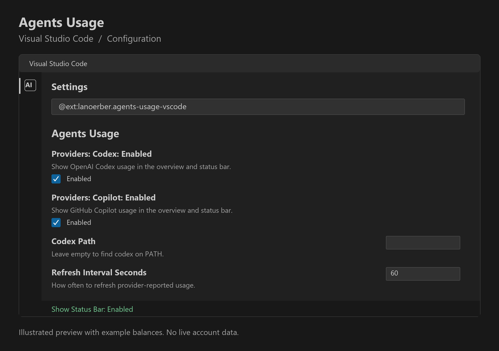

# AgentMeter for Visual Studio Code

The VS Code extension reads the provider-reported OpenAI Codex 5-hour and weekly quotas from the locally installed
Codex CLI app-server. It displays remaining percentages and reset times in the AgentMeter Activity Bar view and an
OpenAI Codex status bar item.

It also reads GitHub Copilot quota snapshots and displays consumed quota in the view and status bar. Select **Sign in
to GitHub** in the Copilot section when prompted. The Copilot reader uses VS Code's GitHub authentication and GitHub's
internal Copilot quota endpoint because VS Code does not expose Copilot quota to third-party extensions through a
public quota API. GitHub may change this endpoint without notice. The extension does not read local prompt history or
estimate quota from activity. VS Code's
built-in [Copilot usage dashboard](https://code.visualstudio.com/docs/setup/copilot#_monitor-your-usage)
remains available from the Copilot status-bar item.

Codex CLI must be installed and signed in to read Codex usage. Use **AgentMeter: Open Settings** to set its
executable path or change the refresh interval.
This extension displays quota only. To chat with Codex and use it as a coding agent in VS Code, install the separate
[OpenAI Codex extension](https://marketplace.visualstudio.com/items?itemName=openai.chatgpt).

## Usage preview

Illustrated VS Code preview with example balances, not a live account screenshot. OpenAI Codex shows remaining
5-hour and weekly quota; GitHub Copilot shows consumed quota. Subscription plans and reset times appear below
the colored bars. Available quotas depend on your account and subscription.

## Configuration

Illustrated settings preview. Select the providers to display, configure the Codex CLI path and refresh interval,
and choose whether to show status indicators. Disabling a provider also pauses its quota reads.
Open configuration through the **Settings** button or **AgentMeter: Open Settings**.

## Build

Run `npm install` in this directory, then `npm run package`. The package version is synchronized from the root
`gradle.properties`, and the resulting VSIX is `agents-usage-vscode-<version>.vsix`.

For repository setup and the combined Rider and VS Code build, see
the [development guide](https://github.com/larsnoerber/Rider_Agents_Usage/blob/main/docs/DEVELOPMENT.md).

This independent extension is not affiliated with or endorsed by OpenAI. Codex is a trademark of OpenAI.
